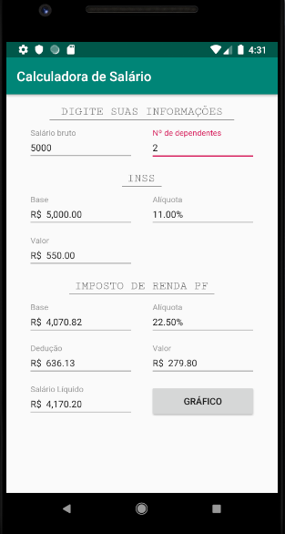
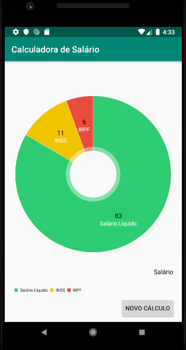

# Calculadora Salario

Aplicativo Android que, a partir de uma entrada de salário bruto e número de dependentes, retorna ao usuário informações sobre INSS e Imposto de Renda da Pessoa Física (IRPF), com seus devidos percentuais e valores, proporcional às entradas fornecidas. Adicionamente, o app gera um gráfico no formatpo pizza mostrando a proporção do salário que é destinada ao INSS e ao IR.

## Imagens

